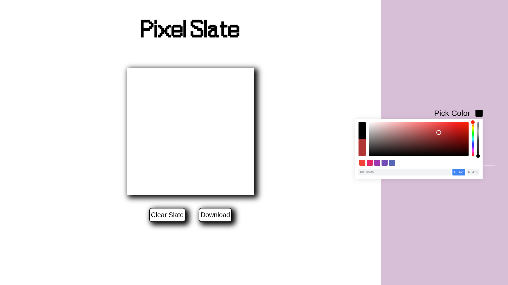

# Pixel Slate

A website for creating cool pixel arts. Made using vanilla javascript

## features
* Pixel arts can be downloaded as .png files
* Users can change grid-size of canvas
* Colour of brush can be picked from colour picker
* Rainbow mode & Erase mode

## credits
* [Pickr](https://github.com/Simonwep/pickr) 
* [html2canvas](https://html2canvas.hertzen.com/?ref=hackernoon.com)

## screenshots

